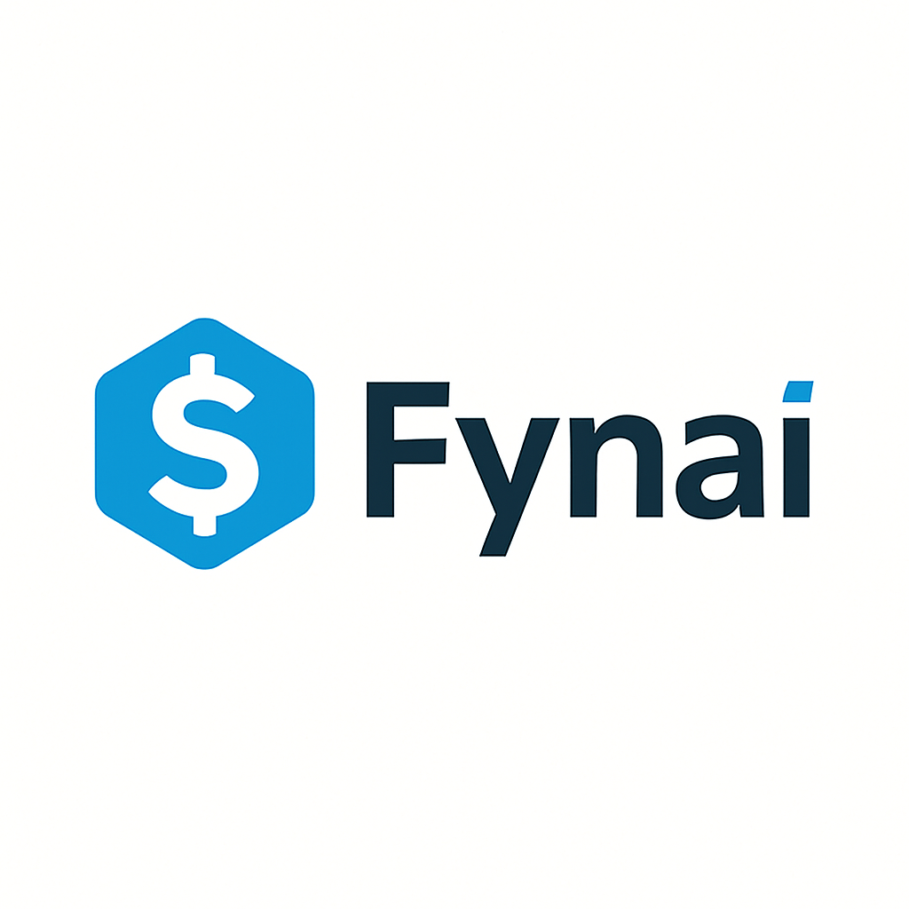
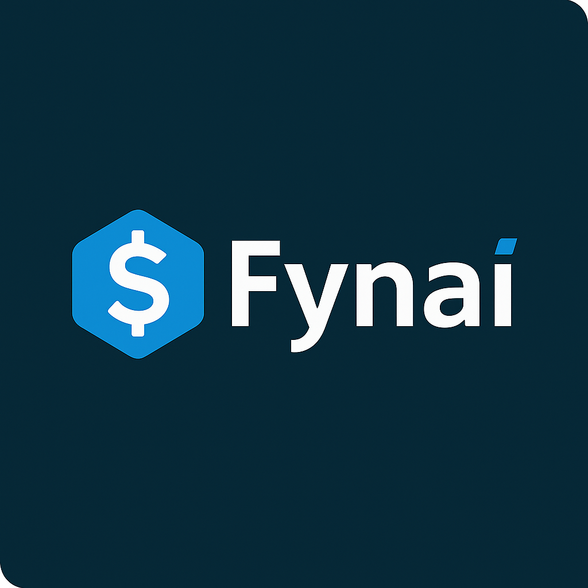
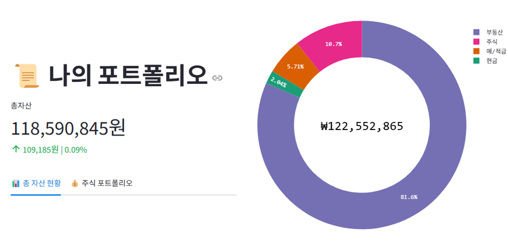
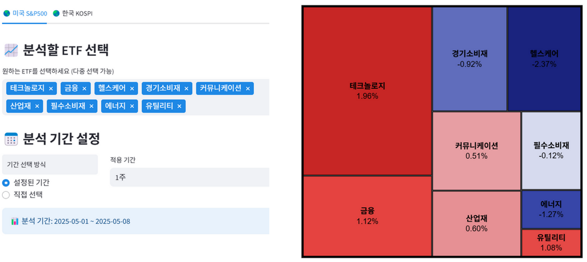
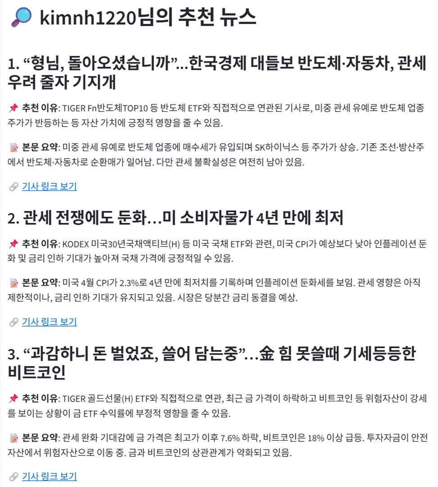
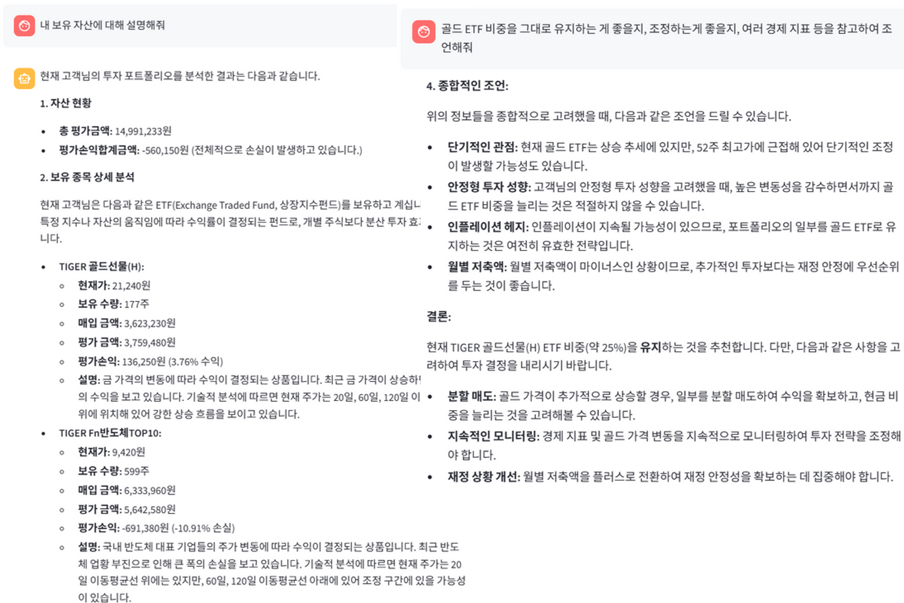
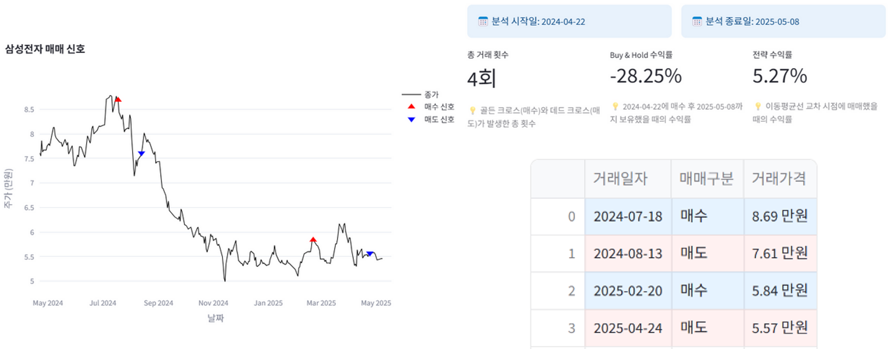
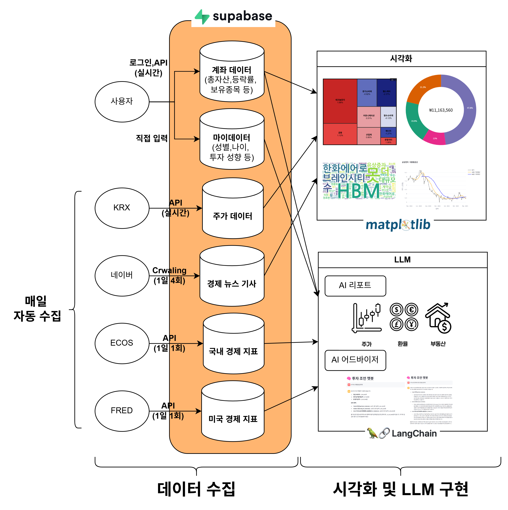

    

        
        <h1 style="color: white; font-size: 3.2rem; margin-bottom: 1.2rem; font-weight: 800;">Fynai</h1>
        
AI 기반 스마트 자산 관리 솔루션

        <a href="https://capstone-2025-41-assetmanagementdashboard.streamlit.app/" style="display: inline-block; background-color: #4CAF50; color: white; padding: 1.2rem 2.8rem; text-decoration: none; border-radius: 50px; font-weight: bold; font-size: 1.2rem; transition: all 0.3s; box-shadow: 0 4px 12px rgba(0,0,0,0.13);">지금 시작하기</a>
    

    

        <h2 style="color: #2E4057; text-align: center; margin-bottom: 2rem;">주요 기능</h2>
        

            

                <h3 style="color: #2E4057;">📊 실시간 자산 분석</h3>
                
AI 기반 실시간 자산 분석 및 추천

            

            

                <h3 style="color: #2E4057;">📈 포트폴리오 최적화</h3>
                
최적의 자산 배분 전략 제시

            

            

                <h3 style="color: #2E4057;">🔍 시장 인사이트</h3>
                
실시간 시장 동향 및 뉴스 분석

            

        

    

# 💰 Asset Management Dashboard

    <h2 align="center">당신의 자산을 스마트하게 관리하세요</h2>
    

        실시간 포트폴리오 분석 | AI 기반 자산 관리 조언 | 글로벌 ETF 분석
    

    

        <a href="#overview">프로젝트 소개</a> •
        <a href="#features">핵심 기능</a> •
        <a href="#preview">기능 미리보기</a> •
        <a href="#tech">기술 스택</a> •
        <a href="#usage">사용 방법</a> •
        <a href="#team">팀 소개</a>
    

---

<h2 id="overview">📊 프로젝트 소개</h2>

> "복잡한 자산 관리를 간단하게, 어려운 투자 결정을 스마트하게"

자산 관리 대시보드는 개인 투자자를 위한 올인원 자산 관리 플랫폼입니다. 
실시간 포트폴리오 분석부터 AI 기반 투자 조언까지, 여러분의 현명한 투자 결정을 도와드립니다.

### 🌟 주요 특징
- **실시간 자산 추적**: 한국투자증권 API를 통한 실시간 자산 모니터링
- **AI 기반 분석**: GPT-4와 Gemini Pro를 활용한 지능형 투자 조언
- **글로벌 ETF 분석**: 국내외 ETF 섹터별 분석 및 시각화
- **실시간 경제 뉴스**: 네이버 뉴스 API를 통한 최신 경제 동향 분석

    

<h2 id="features">⚡ 핵심 기능</h2>

### 1. 통합 자산 관리 💼
- **실시간 포트폴리오 모니터링**
  - 한국투자증권 API 연동을 통한 실시간 자산 조회
  - 주식, ETF, 현금 자산의 통합 관리
  - 자산 별 수익률 및 포트폴리오 구성 시각화

### 2. ETF 마켓 인사이트 📈
- **글로벌 ETF 분석**
  - S&P500 및 KOSPI 기반 ETF 섹터별 분석
  - 트리맵을 통한 직관적인 섹터 성과 시각화
  - 실시간 ETF 데이터 수집 및 분석

### 3. 뉴스 & 마켓 인텔리전스 📰
- **실시간 경제 뉴스 분석**
  - 네이버 뉴스 API를 통한 실시간 경제 뉴스 수집
  - 워드클라우드를 통한 키워드 트렌드 분석
  - 뉴스 데이터 시각화

### 4. AI 투자 어시스턴트 🤖
- **맞춤형 포트폴리오 분석**
  - 개인 투자 성향 기반 포트폴리오 분석
  - 거시경제 동향 리포트 제공
  - 부동산 시장 동향 분석
  - AI 기반 투자 상담 서비스

### 5. 백테스팅 시스템 📊
- **투자 전략 검증**
  - 다양한 투자 전략 템플릿 제공
  - 과거 데이터 기반 전략 성과 시뮬레이션
  - 수익률, 위험 지표 등 종합 분석
  - 벤치마크 대비 성과 비교

<h2 id="preview">🎬 데모 & 기능 소개</h2>

### 🎥 시연 동영상

    
    
<i>▶️ 이미지를 클릭하여 시연 동영상 보기</i>

  
  

    <h3 style="margin: 0; color: #2E4057; font-size: 2rem; font-weight: 700;">주요 기능 미리보기</h3>
    
Fynai의 핵심 기능을 한눈에 확인하세요.

  

    

        <h4>💼 통합 자산 관리</h4>
        
    

    

        <h4>📈 ETF 마켓 인사이트</h4>
        
    

    

        <h4>📰 뉴스 & 마켓 인텔리전스</h4>
        
    

    

        <h4>🤖 AI 투자 어시스턴트</h4>
        
    

    

        <h4>📊 백테스팅 시스템</h4>
        
    

### 🔄 시스템 구조도

    
    
<i>자산 관리 대시보드 시스템 아키텍처</i>

<h2 id="tech">🛠 기술 스택</h2>

<h3 style="color: #2E4057; margin-bottom: 1.5rem;">💻 Core Technologies</h3>

<table style="border: none; background: transparent;">
  <tr>
    <td align="center" width="25%"><h4>프론트엔드</h4></td>
    <td align="center" width="25%"><h4>백엔드</h4></td>
    <td align="center" width="25%"><h4>데이터 & AI</h4></td>
    <td align="center" width="25%"><h4>인프라 & 도구</h4></td>
  </tr>
  <tr style="background: transparent;">
    <td align="center">
       
      
    </td>
    <td align="center">
       
      
    </td>
    <td align="center">
       
       
       
       
      
    </td>
    <td align="center">
       
       
      
    </td>
  </tr>
</table>

<h3 style="color: #2E4057; margin: 2rem 0 1.5rem 0;">🔌 External APIs</h3>

<table style="border: none; background: transparent;">
  <tr>
    <td align="center" width="50%"><h4>금융 데이터</h4></td>
    <td align="center" width="50%"><h4>AI & 분석</h4></td>
  </tr>
  <tr style="background: transparent;">
    <td align="center">
       
       
      
    </td>
    <td align="center">
       
       
    </td>
  </tr>
</table>

<h2 id="usage">💫 사용 방법</h2>

1️⃣ [자산 관리 대시보드](https://capstone-2025-41-assetmanagementdashboard.streamlit.app/)에 접속합니다.

2️⃣ 주요 기능 사용하기
- **회원가입 및 로그인**: 한국투자증권 API 키를 등록하여 실시간 자산 관리 시작
- **포트폴리오 관리**: 실시간 자산 현황 모니터링 및 분석
- **ETF 분석**: 국내외 ETF 섹터별 분석 및 시각화 확인
- **AI 투자 조언**: AI 어시스턴트를 통한 맞춤형 투자 상담
- **뉴스 분석**: 실시간 경제 뉴스 및 키워드 트렌드 확인

💡 별도의 설치 과정 없이 웹 브라우저에서 바로 이용 가능합니다!

<h2 id="team">👥 팀 소개</h2>

<table>
  <tr>
    <td align="center">
       
      <b>김남훈</b> 
      프론트엔드 & 백엔드 
      
    </td>
    <td align="center">
       
      <b>박규민</b> 
      프론트엔드 & 백엔드 
      
    </td>
  </tr>
</table>

## 📚 문서 & 리소스

- [발표 자료](docs/user-guide.md)
- [포스터](docs/api-docs.md)

## 📬 문의하기

프로젝트에 대한 문의나 제안이 있으시다면 언제든 연락주세요:
- 📧 Email: 
  - ???@kookmin.ac.kr (김남훈)
  - gyumin1129@kookmin.ac.kr (박규민)
- 💬 GitHub: [Repository](https://github.com/kookmin-sw/capstone-2025-41)

---

    
    <h2 style="margin-bottom: 1rem; font-size: 2rem;">Fynai와 함께 시작하세요</h2>
    
AI 기반의 스마트한 자산 관리를 경험해보세요

    <a href="https://capstone-2025-41-assetmanagementdashboard.streamlit.app/" style="display: inline-block; background-color: #4CAF50; color: white; padding: 1rem 2.5rem; text-decoration: none; border-radius: 50px; font-weight: bold; font-size: 1.1rem; transition: all 0.3s ease; box-shadow: 0 4px 6px rgba(0,0,0,0.1);">지금 시작하기</a>

