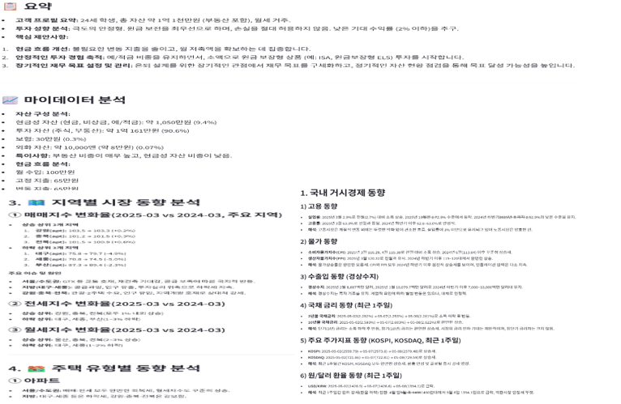

    

        

            
            <h1 style="color: white; font-size: 3.2rem; margin-bottom: 1.2rem; font-weight: 800;">Fynai</h1>
            
AI 기반 스마트 자산 관리 솔루션

            <a href="https://capstone-2025-41-assetmanagementdashboard.streamlit.app/" style="display: inline-block; background-color: #4CAF50; color: white; padding: 1.2rem 2.8rem; text-decoration: none; border-radius: 50px; font-weight: bold; font-size: 1.2rem; transition: all 0.3s; box-shadow: 0 4px 12px rgba(0,0,0,0.13);">지금 시작하기</a>
        

    

    

        <h2 style="color: #2E4057; text-align: center; margin-bottom: 2rem; font-size: 2rem;">주요 기능</h2>
        

            

                <h3 style="color: #2E4057;">📊 실시간 자산 분석</h3>
                
AI 기반 실시간 자산 분석 및 추천

            

            

                <h3 style="color: #2E4057;">📈 포트폴리오 최적화</h3>
                
최적의 자산 배분 전략 제시

            

            

                <h3 style="color: #2E4057;">🔍 시장 인사이트</h3>
                
실시간 시장 동향 및 뉴스 분석

            

        

    

    

        <h1 style="color: #2E4057; text-align: center; margin-bottom: 2rem;">💰 Asset Management Dashboard</h1>
        
        

            <h2 style="color: #2E4057; margin-bottom: 1rem;">당신의 자산을 스마트하게 관리하세요</h2>
            

                실시간 포트폴리오 분석 | AI 기반 자산 관리 조언 | 일일 시장 키워드 인사이트
            

            

                <a href="#overview" style="text-decoration: none; color: #2E4057;">프로젝트 소개</a>
                •
                <a href="#features" style="text-decoration: none; color: #2E4057;">핵심 기능</a>
                •
                <a href="#preview" style="text-decoration: none; color: #2E4057;">기능 미리보기</a>
                •
                <a href="#tech" style="text-decoration: none; color: #2E4057;">기술 스택</a>
                •
                <a href="#usage" style="text-decoration: none; color: #2E4057;">사용 방법</a>
                •
                <a href="#team" style="text-decoration: none; color: #2E4057;">팀 소개</a>
            

        

    

    

        <h2 style="color: #2E4057; margin-bottom: 1.5rem;">📊 프로젝트 소개</h2>
        
        

            <blockquote style="border-left: 4px solid #4CAF50; padding-left: 1rem; margin: 0 0 1.5rem 0; color: #2E4057; font-style: italic;">
                "복잡한 자산 관리를 간단하게, 어려운 투자 결정을 스마트하게"
            </blockquote>
            
            

                

                    Fynai는 개인 투자자를 위한 올인원 자산 관리 플랫폼입니다.
                

                

                    

                        🌅
                        
매일 아침, 당신의 관심사를 반영한 시장 인사이트로 하루를 시작하고,

                    

                    

                        📊
                        
실시간 포트폴리오 분석과 AI 기반 투자 조언을 통해 현명한 투자 결정을 내리세요.

                    

                    

                        💡
                        
궁금한 점이 있다면 언제든 AI 어드바이저와 대화하며 더 깊은 인사이트를 얻을 수 있습니다.

                    

                

            

        

    

    

        <h2 style="color: #2E4057; margin-bottom: 2rem; font-size: 2rem;">⚡ 핵심 기능</h2>
        
        

            <!-- 1. 통합 자산 관리 -->
            

                <h3 style="color: #2E4057; margin-bottom: 1rem; font-size: 1.3rem;">1. 통합 자산 관리 💼</h3>
                

                    <h4 style="color: #4CAF50; font-size: 1.1rem; margin-bottom: 0.5rem;">실시간 포트폴리오 모니터링</h4>
                    <ul style="list-style-type: none; padding-left: 0;">
                        <li style="margin-bottom: 0.5rem; color: #495057;">• 한국투자증권 API 연동을 통한 실시간 자산 조회</li>
                        <li style="margin-bottom: 0.5rem; color: #495057;">• 주식, ETF, 현금 자산의 통합 관리</li>
                        <li style="color: #495057;">• 자산 별 수익률 및 포트폴리오 구성 시각화</li>
                    </ul>
                

            

            <!-- 2. ETF 마켓 인사이트 -->
            

                <h3 style="color: #2E4057; margin-bottom: 1rem; font-size: 1.3rem;">2. ETF 마켓 인사이트 📊</h3>
                

                    <h4 style="color: #2196F3; font-size: 1.1rem; margin-bottom: 0.5rem;">글로벌 ETF 분석</h4>
                    <ul style="list-style-type: none; padding-left: 0;">
                        <li style="margin-bottom: 0.5rem; color: #495057;">• S&P500 및 KOSPI 기반 ETF 섹터별 분석</li>
                        <li style="margin-bottom: 0.5rem; color: #495057;">• 트리맵을 통한 직관적인 섹터 성과 시각화</li>
                        <li style="color: #495057;">• 실시간 ETF 데이터 수집 및 분석</li>
                    </ul>
                

            

            <!-- 3. 뉴스 & 마켓 인텔리전스 -->
            

                <h3 style="color: #2E4057; margin-bottom: 1rem; font-size: 1.3rem;">3. 뉴스 & 마켓 인텔리전스 📰</h3>
                

                    <h4 style="color: #FF9800; font-size: 1.1rem; margin-bottom: 0.5rem;">실시간 경제 뉴스 분석</h4>
                    <ul style="list-style-type: none; padding-left: 0;">
                        <li style="margin-bottom: 0.5rem; color: #495057;">• 실시간 경제 뉴스 수집</li>
                        <li style="margin-bottom: 0.5rem; color: #495057;">• 워드클라우드를 통한 키워드 트렌드 분석</li>
                        <li style="color: #495057;">• 뉴스 데이터 시각화</li>
                    </ul>
                

            

            <!-- 4. 자산 진단 및 경제 동향 리포트 -->
            

                <h3 style="color: #2E4057; margin-bottom: 1rem; font-size: 1.3rem;">4. 자산 진단 리포트 📑</h3>
                

                    <h4 style="color: #673AB7; font-size: 1.1rem; margin-bottom: 0.5rem;">종합 자산 분석</h4>
                    <ul style="list-style-type: none; padding-left: 0;">
                        <li style="margin-bottom: 0.5rem; color: #495057;">• 맞춤형 포트폴리오 분석</li>
                        <li style="margin-bottom: 0.5rem; color: #495057;">• 거시경제 동향 및 시장 전망 리포트</li>
                        <li style="margin-bottom: 0.5rem; color: #495057;">• 부동산 시장 동향 분석</li>
                        <li style="color: #495057;">• 자산 배분 최적화 제안</li>
                    </ul>
                

            

            <!-- 5. 일일 인사이트 메일 -->
            

                <h3 style="color: #2E4057; margin-bottom: 1rem; font-size: 1.3rem;">5. 일일 인사이트 메일 📧</h3>
                

                    <h4 style="color: #FF9800; font-size: 1.1rem; margin-bottom: 0.5rem;">맞춤형 일일 리포트</h4>
                    <ul style="list-style-type: none; padding-left: 0;">
                        <li style="margin-bottom: 0.5rem; color: #495057;">• 매일 오전 시장 동향 및 투자 기회 알림</li>
                        <li style="margin-bottom: 0.5rem; color: #495057;">• 포트폴리오 수익률 및 주요 변동 알림</li>
                        <li style="margin-bottom: 0.5rem; color: #495057;">• 투자 리스크 및 주의사항 안내</li>
                        <li style="color: #495057;">• 맞춤형 투자 액션 제안</li>
                    </ul>
                

            

            <!-- 6. AI 어드바이저 -->
            

                <h3 style="color: #2E4057; margin-bottom: 1rem; font-size: 1.3rem;">6. AI 어드바이저 🤖</h3>
                

                    <h4 style="color: #9C27B0; font-size: 1.1rem; margin-bottom: 0.5rem;">맞춤형 투자 상담</h4>
                    <ul style="list-style-type: none; padding-left: 0;">
                        <li style="margin-bottom: 0.5rem; color: #495057;">• 자산 진단 리포트 기반 상세 상담</li>
                        <li style="margin-bottom: 0.5rem; color: #495057;">• 실시간 투자 관련 질문 답변</li>
                        <li style="margin-bottom: 0.5rem; color: #495057;">• 포트폴리오 분석 및 개선 제안</li>
                        <li style="margin-bottom: 0.5rem; color: #495057;">• 투자 전략 및 자산 배분 가이드</li>
                    </ul>
                

            

            <!-- 7. 백테스팅 시스템 -->
            

                <h3 style="color: #2E4057; margin-bottom: 1rem; font-size: 1.3rem;">7. 백테스팅 시스템 📈</h3>
                

                    <h4 style="color: #F44336; font-size: 1.1rem; margin-bottom: 0.5rem;">투자 전략 검증</h4>
                    <ul style="list-style-type: none; padding-left: 0;">
                        <li style="margin-bottom: 0.5rem; color: #495057;">• 다양한 투자 전략 템플릿 제공</li>
                        <li style="margin-bottom: 0.5rem; color: #495057;">• 과거 데이터 기반 전략 성과 시뮬레이션</li>
                        <li style="margin-bottom: 0.5rem; color: #495057;">• 수익률, 위험 지표 등 종합 분석</li>
                        <li style="color: #495057;">• 벤치마크 대비 성과 비교</li>
                    </ul>
                

            

        

    

    

        <h3 style="color: #2E4057; font-size: 1.5rem; margin-bottom: 1.5rem;">🎥 시연 동영상</h3>
        

            
            
▶️ 이미지를 클릭하여 시연 동영상 보기

        

    

    

      
      

        <h3 style="margin: 0; color: #2E4057; font-size: 2rem; font-weight: 700;">주요 기능 미리보기</h3>
        
Fynai의 핵심 기능을 한눈에 확인하세요.

      

    

    

        

            <h4 style="text-align: center; color: #2E4057; margin-bottom: 15px;">💼 통합 자산 관리</h4>
            
        

        

            <h4 style="text-align: center; color: #2E4057; margin-bottom: 15px;">📊 ETF 마켓 인사이트</h4>
            
        

        

            <h4 style="text-align: center; color: #2E4057; margin-bottom: 15px;">📰 뉴스 & 마켓 인텔리전스</h4>
            
        

        

            <h4 style="text-align: center; color: #2E4057; margin-bottom: 15px;">📑 자산 진단 리포트</h4>
            
        

        

            <h4 style="text-align: center; color: #2E4057; margin-bottom: 15px;">📧 일일 인사이트 메일</h4>
            
        

        

            <h4 style="text-align: center; color: #2E4057; margin-bottom: 15px;">🤖 AI 어드바이저</h4>
            
        

        

            <h4 style="text-align: center; color: #2E4057; margin-bottom: 15px;">📈 백테스팅 시스템</h4>
            
        

        <a class="prev" onclick="plusSlides(-1)" style="cursor: pointer; position: absolute; top: 50%; width: auto; padding: 16px; margin-top: -22px; color: white; font-weight: bold; font-size: 18px; transition: 0.6s ease; border-radius: 0 3px 3px 0; user-select: none; background-color: rgba(0,0,0,0.3); left: 0;">❮</a>
        <a class="next" onclick="plusSlides(1)" style="cursor: pointer; position: absolute; top: 50%; width: auto; padding: 16px; margin-top: -22px; color: white; font-weight: bold; font-size: 18px; transition: 0.6s ease; border-radius: 3px 0 0 3px; user-select: none; background-color: rgba(0,0,0,0.3); right: 0;">❯</a>
    

    

        
        
        
        
        
        
        
    

    

    

    

        <h3 style="color: #2E4057; font-size: 1.5rem; margin-bottom: 1.5rem;">🔄 시스템 구조도</h3>
        

            
            
자산 관리 대시보드 시스템 아키텍처

        

    

    

        <h2 style="color: #2E4057; margin-bottom: 2rem; font-size: 2rem;">🛠 기술 스택</h2>
        

            

                <!-- Frontend -->
                

                    <h3 style="color: #2E4057; margin-bottom: 1.5rem; font-size: 1.8rem; font-weight: 700; text-align: center; padding-bottom: 0.5rem; border-bottom: 2px solid #4CAF50;">Frontend</h3>
                    <ul style="list-style-type: none; padding-left: 0;">
                        <li style="margin-bottom: 0.5rem;">
                            <strong>Programming Language</strong>
                            

                                
                            

                        </li>
                        <li style="margin-bottom: 0.5rem;">
                            <strong>UI Framework</strong>
                            

                                
                            

                        </li>
                        <li style="margin-bottom: 0.5rem;">
                            <strong>Styling</strong>
                            

                                
                            

                        </li>
                        <li style="margin-bottom: 0.5rem;">
                            <strong>Package Manager</strong>
                            

                                
                            

                        </li>
                    </ul>
                

                <!-- Backend -->
                

                    <h3 style="color: #2E4057; margin-bottom: 1.5rem; font-size: 1.8rem; font-weight: 700; text-align: center; padding-bottom: 0.5rem; border-bottom: 2px solid #2196F3;">Backend</h3>
                    <ul style="list-style-type: none; padding-left: 0;">
                        <li style="margin-bottom: 0.5rem;">
                            <strong>Programming Language</strong>
                            

                                
                            

                        </li>
                        <li style="margin-bottom: 0.5rem;">
                            <strong>Framework</strong>
                            

                                
                            

                        </li>
                        <li style="margin-bottom: 0.5rem;">
                            <strong>API</strong>
                            

                                
                                
                                
                                
                            

                        </li>
                        <li style="margin-bottom: 0.5rem;">
                            <strong>Database</strong>
                            

                                
                            

                        </li>
                    </ul>
                

                <!-- AI -->
                

                    <h3 style="color: #2E4057; margin-bottom: 1.5rem; font-size: 1.8rem; font-weight: 700; text-align: center; padding-bottom: 0.5rem; border-bottom: 2px solid #FF9800;">AI (LLM)</h3>
                    <ul style="list-style-type: none; padding-left: 0;">
                        <li style="margin-bottom: 0.5rem;">
                            <strong>Programming Language</strong>
                            

                                
                            

                        </li>
                        <li style="margin-bottom: 0.5rem;">
                            <strong>Framework</strong>
                            

                                
                            

                        </li>
                        <li style="margin-bottom: 0.5rem;">
                            <strong>API</strong>
                            

                                
                                
                            

                        </li>
                        <li>
                            <strong>Library</strong>
                            

                            

                        </li>
                    </ul>
                

                <!-- Development & Deployment -->
                

                    <h3 style="color: #2E4057; margin-bottom: 1.5rem; font-size: 1.8rem; font-weight: 700; text-align: center; padding-bottom: 0.5rem; border-bottom: 2px solid #673AB7;">Development & Deployment</h3>
                    <ul style="list-style-type: none; padding-left: 0;">
                        <li style="margin-bottom: 0.5rem;">
                            <strong>Web Service</strong>
                            

                                
                            

                        </li>
                        <li style="margin-bottom: 0.5rem;">
                            <strong>CI/CD</strong>
                            

                                
                            

                        </li>
                        <li>
                            <strong>Version Control</strong>
                            

                                
                                
                            

                        </li>
                    </ul>
                

                <!-- Common -->
                

                    <h3 style="color: #2E4057; margin-bottom: 1.5rem; font-size: 1.8rem; font-weight: 700; text-align: center; padding-bottom: 0.5rem; border-bottom: 2px solid #9C27B0;">Common</h3>
                    <ul style="list-style-type: none; padding-left: 0;">
                        <li style="margin-bottom: 0.5rem;">
                            <strong>Design</strong>
                            

                                
                            

                        </li>
                        <li style="margin-bottom: 0.5rem;">
                            <strong>Version Control</strong>
                            

                                
                                
                            

                        </li>
                        <li>
                            <strong>기타 라이브러리</strong>
                            

                                
                                
                                
                                
                            

                        </li>
                    </ul>
                

            

        

    

    

        <h2 style="color: #2E4057; margin-bottom: 2rem; font-size: 2rem;">💫 사용 방법</h2>
        

            <ol style="list-style-type: none; padding-left: 0;">
                <li style="margin-bottom: 1.5rem;">
                    <a href="https://capstone-2025-41-assetmanagementdashboard.streamlit.app/" style="text-decoration: none; color: #2E4057; font-weight: bold;">자산 관리 대시보드</a>에 접속합니다.
                </li>
                <li>
                    <strong>주요 기능 사용하기</strong>
                    

                        

                            <h4 style="color: #4CAF50; margin-bottom: 1rem;">🔐 회원가입 및 로그인</h4>
                            <ul style="list-style-type: none; padding-left: 0;">
                                <li style="margin-bottom: 0.5rem;">• 한국투자증권 API 키 등록</li>
                                <li style="margin-bottom: 0.5rem;">• 투자자 프로필 설정</li>
                                <li>• 실시간 자산 관리 시작</li>
                            </ul>
                        

                        

                            <h4 style="color: #2196F3; margin-bottom: 1rem;">💼 포트폴리오 관리</h4>
                            <ul style="list-style-type: none; padding-left: 0;">
                                <li style="margin-bottom: 0.5rem;">• 실시간 자산 현황 모니터링</li>
                                <li style="margin-bottom: 0.5rem;">• 자산 배분 분석</li>
                                <li>• 수익률 및 위험 지표 확인</li>
                            </ul>
                        

                        

                            <h4 style="color: #FF9800; margin-bottom: 1rem;">📊 ETF 분석</h4>
                            <ul style="list-style-type: none; padding-left: 0;">
                                <li style="margin-bottom: 0.5rem;">• 국내외 ETF 섹터별 분석</li>
                                <li style="margin-bottom: 0.5rem;">• 트리맵 시각화 확인</li>
                                <li>• 실시간 ETF 데이터 분석</li>
                            </ul>
                        

                         

                            <h4 style="color: #F44336; margin-bottom: 1rem;">📰 뉴스 분석</h4>
                            <ul style="list-style-type: none; padding-left: 0;">
                                <li style="margin-bottom: 0.5rem;">• 실시간 경제 뉴스 확인</li>
                                <li style="margin-bottom: 0.5rem;">• 키워드 트렌드 분석</li>
                                <li>• 시장 동향 파악</li>
                            </ul>
                        

                        

                            <h4 style="color: #673AB7; margin-bottom: 1rem;">📑 자산 진단 리포트</h4>
                            <ul style="list-style-type: none; padding-left: 0;">
                                <li style="margin-bottom: 0.5rem;">• 맞춤형 포트폴리오 분석</li>
                                <li style="margin-bottom: 0.5rem;">• 거시경제 동향 및 시장 전망</li>
                                <li>• 부동산 시장 동향 분석</li>
                            </ul>
                        

                        

                            <h4 style="color: #FF9800; margin-bottom: 1rem;">📧 일일 인사이트 메일</h4>
                            <ul style="list-style-type: none; padding-left: 0;">
                                <li style="margin-bottom: 0.5rem;">• 매일 오전 시장 동향 알림</li>
                                <li style="margin-bottom: 0.5rem;">• 포트폴리오 수익률 변동 알림</li>
                                <li>• 맞춤형 투자 액션 제안</li>
                            </ul>
                        

                        
                        

                            <h4 style="color: #9C27B0; margin-bottom: 1rem;">🤖 AI 어드바이저</h4>
                            <ul style="list-style-type: none; padding-left: 0;">
                                <li style="margin-bottom: 0.5rem;">• 실시간 투자 관련 질문 답변</li>
                                <li style="margin-bottom: 0.5rem;">• 포트폴리오 분석 및 개선 제안</li>
                                <li>• 투자 전략 및 자산 배분 가이드</li>
                            </ul>
                        

                        

                            <h4 style="color: #607D8B; margin-bottom: 1rem;">📈 백테스팅</h4>
                            <ul style="list-style-type: none; padding-left: 0;">
                                <li style="margin-bottom: 0.5rem;">• 투자 전략 템플릿 선택</li>
                                <li style="margin-bottom: 0.5rem;">• 과거 데이터 기반 시뮬레이션</li>
                                <li>• 전략 성과 분석</li>
                            </ul>
                        

                    

                </li>
            </ol>
            
💡 별도의 설치 과정 없이 웹 브라우저에서 바로 이용 가능합니다!

        

    

    

        <h2 style="color: #2E4057; margin-bottom: 2rem; font-size: 2rem;">👥 팀 소개</h2>
        

            

                 
                <b>김남훈</b> 
                프론트엔드 & 백엔드 
                
            

            

                 
                <b>박규민</b> 
                프론트엔드 & 백엔드 
                
            

        

    

    

        <h2 style="color: #2E4057; margin-bottom: 1.5rem;">📚 문서 & 리소스</h2>
        

            

                <h3 style="color: #4CAF50; margin-bottom: 1rem;">📊 발표 자료</h3>
                
프로젝트 발표 자료를 확인하세요

                <a href="docs/user-guide.md" style="display: inline-block; background-color: #4CAF50; color: white; padding: 0.8rem 1.5rem; text-decoration: none; border-radius: 50px; font-weight: 500; transition: all 0.3s ease;">자료 보기</a>
            

            

                <h3 style="color: #2196F3; margin-bottom: 1rem;">🖼️ 포스터</h3>
                
프로젝트 포스터를 확인하세요

                <a href="assets/posters.png" style="display: inline-block; background-color: #2196F3; color: white; padding: 0.8rem 1.5rem; text-decoration: none; border-radius: 50px; font-weight: 500; transition: all 0.3s ease;">포스터 보기</a>
            

        

    

    

        <h2 style="color: #2E4057; margin-bottom: 1.5rem;">📬 문의하기</h2>
        
프로젝트에 대한 문의나 제안이 있으시다면 언제든 연락주세요:

        

            

                <h3 style="color: #2E4057; font-size: 1.2rem; margin-bottom: 1rem;">📧 Email</h3>
                

                    

                        
김남훈

                        <a href="mailto:kimnh1220@kookmin.ac.kr" style="text-decoration: none; color: #2E4057; font-weight: 500; display: block; margin-top: 0.3rem;">kimnh1220@kookmin.ac.kr</a>
                    

                    

                        
박규민

                        <a href="mailto:gyumin1129@kookmin.ac.kr" style="text-decoration: none; color: #2E4057; font-weight: 500; display: block; margin-top: 0.3rem;">gyumin1129@kookmin.ac.kr</a>
                    

                

            

            

                <h3 style="color: #2E4057; font-size: 1.2rem; margin-bottom: 1rem;">💬 GitHub</h3>
                
프로젝트 저장소를 방문하세요

                
            

        

    

    

    

        
        <h2 style="margin-bottom: 1rem; font-size: 2rem;">Fynai와 함께 시작하세요</h2>
        
AI 기반의 스마트한 자산 관리를 경험해보세요

        <a href="https://capstone-2025-41-assetmanagementdashboard.streamlit.app/" style="display: inline-block; background-color: #4CAF50; color: white; padding: 1rem 2.5rem; text-decoration: none; border-radius: 50px; font-weight: bold; font-size: 1.1rem; transition: all 0.3s ease; box-shadow: 0 4px 6px rgba(0,0,0,0.1);">지금 시작하기</a>
    

